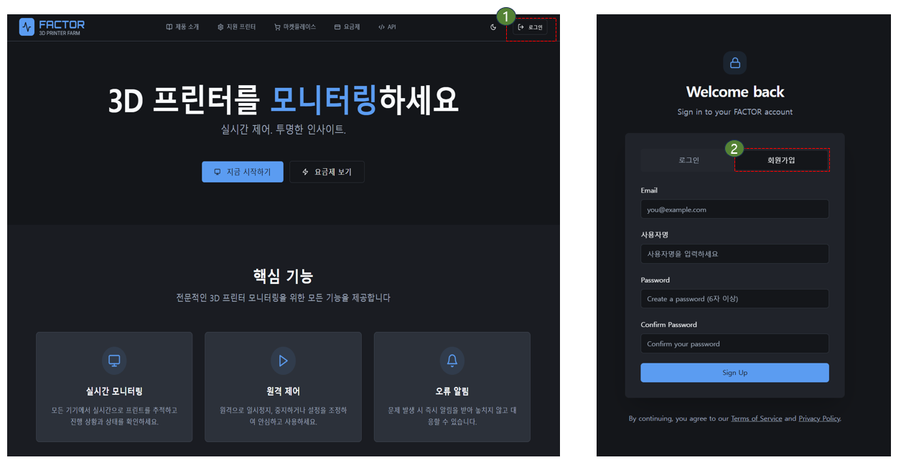
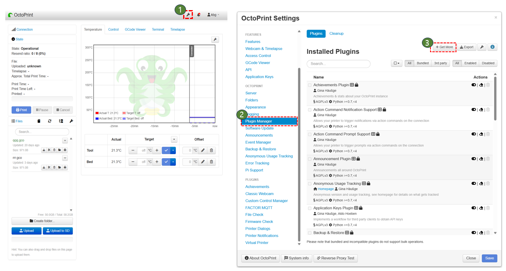
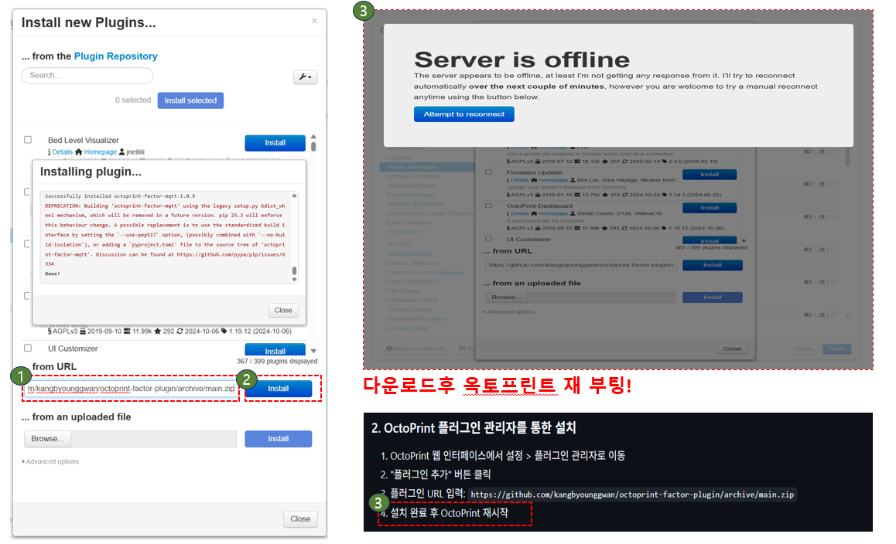
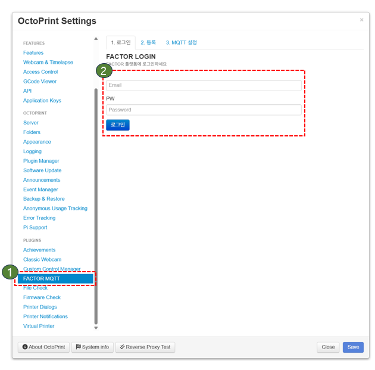
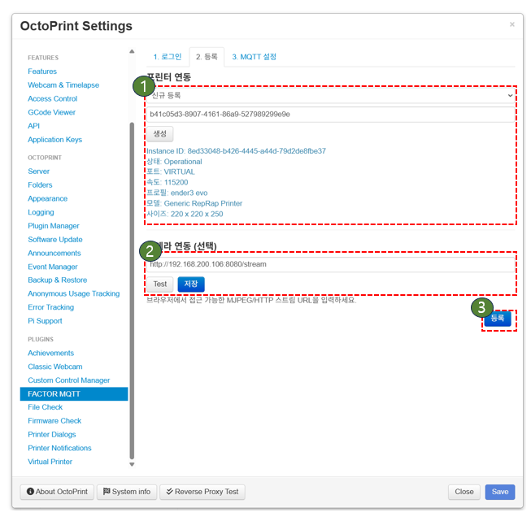
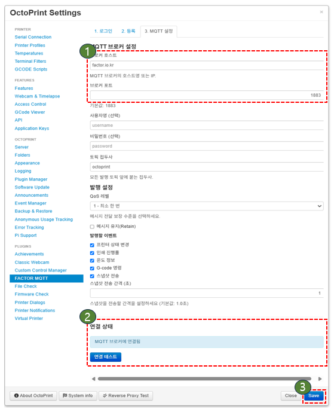
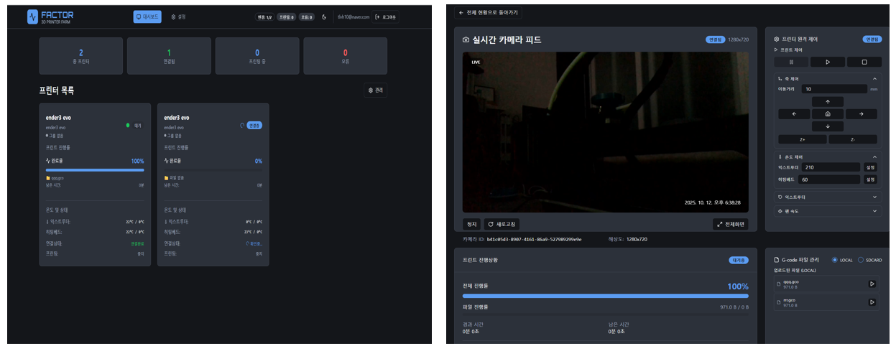

# FACTOR × OctoPrint — 외부 모니터링 & 카메라 연동

<div align="center">


**3D 프린터를 어디서든 모니터링하세요**

하루 종일 출력 돌려놓고 집에 오니 **스파게티/익스트루더 꼬임**…
그래서 **OctoPrint와 연동되는 외부 모니터링 플랫폼 'FACTOR'**를 만들었습니다.

[](https://github.com/kangbyounggwan/octoprint-factor-plugin)
[](https://plugins.octoprint.org)
[](LICENSE)
[](README.md)
[](README_EN.md)

**[🌐 웹사이트](https://factor.io.kr)** •
**[📦 다운로드](https://github.com/kangbyounggwan/octoprint-factor-plugin/archive/main.zip)** •
**[📖 문서](https://factor.io.kr/docs)** •
**[💬 이슈 제보](https://github.com/kangbyounggwan/octoprint-factor-plugin/issues)**

</div>

---

## 📋 목차

- [주요 기능](#-주요-기능)
- [빠른 시작](#-빠른-시작)
  - [1단계: 회원가입](#1단계-회원가입)
  - [2단계: 플러그인 설치](#2단계-플러그인-설치)
  - [3단계: 로그인 및 장비 등록](#3단계-로그인-및-장비-등록)
  - [4단계: MQTT 연결](#4단계-mqtt-연결)
- [환경 설정](#-환경-설정)
- [보안 설정](#-보안-설정)
- [문제 해결](#-문제-해결)
- [기여하기](#-기여하기)
- [라이선스](#-라이선스)

---

## ✨ 주요 기능

<table>
<tr>
<td width="50%">

### 🖥️ 실시간 모니터링
- 출력 진행률 및 상태 확인
- 온도, 프린트 시간 추적
- 여러 프린터 동시 모니터링

</td>
<td width="50%">

### 📹 카메라 연동
- MJPEG/WebRTC/RTSP/HLS 지원
- 기존 스트림 URL 그대로 사용
- 실시간 비디오 스트리밍

</td>
</tr>
<tr>
<td width="50%">

### 🔒 보안 강화
- MQTT TLS/SSL 암호화 지원
- Rate limiting 및 입력 검증
- 안전한 명령 실행

</td>
<td width="50%">

### ⚡ 간편한 설치
- 5-10분 내 설정 완료
- 플러그인 자동 업데이트
- 직관적인 UI

</td>
</tr>
</table>

---

## 🚀 빠른 시작

### 📝 사전 요구사항

- OctoPrint 1.4.0 이상
- Python 3.8 이상
- 인터넷 연결

### 1단계: 회원가입

<div align="center">



</div>

1. **웹사이트 접속**: [https://factor.io.kr](https://factor.io.kr)
2. **회원가입 진행**:
   - 우측 상단 **로그인** 클릭
   - **회원가입** 탭 선택
   - 이메일, 사용자명, 비밀번호 입력
   - **Sign Up** 버튼 클릭
3. **이메일 인증**: 메일함에서 인증 링크 클릭

> 💡 **팁**: 이메일이 오지 않는다면 스팸 폴더를 확인하세요.

---

### 2단계: 플러그인 설치

<div align="center">



</div>

1. **OctoPrint 설정 열기**:
   - 우측 상단 **🔧 스패너 아이콘** 클릭
   - **Plugin Manager** 선택

<div align="center">



</div>

2. **URL로 설치**:
   - **Get More…** 버튼 클릭
   - **…from URL** 선택
   - 아래 URL 붙여넣기:
   ```
   https://github.com/kangbyounggwan/octoprint-factor-plugin/archive/main.zip
   ```
   - **Install** 클릭
3. **OctoPrint 재시작**: 설치 완료 후 프롬프트에 따라 재시작

> ⚠️ **주의**: 재시작하지 않으면 플러그인이 활성화되지 않습니다.

---

### 3단계: 로그인 및 장비 등록

<div align="center">



</div>

1. **플러그인 실행**:
   - 좌측 메뉴에서 **FACTOR MQTT** 클릭
   - 1단계에서 생성한 **이메일/비밀번호** 입력
   - **로그인** 버튼 클릭

<div align="center">



</div>

2. **프린터 등록**:
   - **신규 등록** 옵션 선택 (기본값)
   - **생성** 버튼 클릭
   - 자동 생성된 Instance ID 확인

3. **카메라 설정** (선택사항):
   - 스트림 URL 입력 (예: `http://192.168.1.100:8080/stream`)
   - **테스트** 버튼으로 연결 확인
   - **저장** 클릭

> 💡 **지원 형식**: MJPEG, WebRTC, RTSP, HLS

---

### 4단계: MQTT 연결

<div align="center">



</div>

1. **MQTT 브로커 설정**:
   ```
   브로커 호스트: factor.io.kr
   포트: 1883 (평문) 또는 8883 (TLS)
   ```

2. **보안 설정** (권장):
   - ✅ **TLS/SSL 사용** 체크
   - 포트를 **8883**으로 변경

3. **연결 테스트**:
   - **연결 테스트** 버튼 클릭
   - "연결됨" 메시지 확인

4. **설정 저장**:
   - **Save** 버튼 클릭
   - **등록** 버튼으로 최종 완료

<div align="center">



**🎉 설치 완료! 이제 웹사이트에서 프린터를 모니터링하세요.**

</div>

---

## ⚙️ 환경 설정

### MQTT 고급 설정

```yaml
# TLS/SSL 암호화 (권장)
broker_use_tls: true
broker_port: 8883

# 인증서 검증 (프로덕션)
broker_tls_insecure: false
broker_tls_ca_cert: /path/to/ca.crt

# QoS 레벨
qos_level: 1  # 0: 최대 1회, 1: 최소 1회, 2: 정확히 1회

# 주기적 상태 전송 간격 (초)
periodic_interval: 1.0
```

### 카메라 스트림 URL 예시

| 유형 | URL 예시 |
|------|----------|
| **MJPEG** | `http://192.168.1.100:8080/stream` |
| **WebRTC** | `https://factor.io.kr/webrtc/cam1/` |
| **RTSP** | `rtsp://192.168.1.100:8554/stream` |
| **USB 카메라** | `/dev/video0` (Linux) |

---

## 🔐 보안 설정

### 1. MQTT TLS/SSL 활성화

```bash
# 브로커 호스트
factor.io.kr

# TLS 포트 사용
8883

# 설정에서 TLS 체크박스 활성화
✅ TLS/SSL 사용
```

### 2. 방화벽 설정

```bash
# MQTT 포트 열기 (Linux)
sudo ufw allow 1883/tcp  # 평문
sudo ufw allow 8883/tcp  # TLS

# 또는 특정 IP만 허용
sudo ufw allow from 192.168.1.0/24 to any port 1883
```

### 3. 네트워크 보안

- ✅ HTTPS로 웹사이트 접속
- ✅ 강력한 비밀번호 사용
- ✅ 정기적인 플러그인 업데이트
- ⚠️ 공개 네트워크에서는 TLS 필수

---

## 🛠️ 문제 해결

### MQTT 연결 실패

**증상**: "연결 테스트" 실패

**해결 방법**:
1. 네트워크 연결 확인
2. 브로커 호스트/포트 재확인
3. 방화벽 설정 확인
4. OctoPrint 로그 확인: `Settings > Logging > octoprint.plugins.factor_mqtt`

### 카메라 스트림이 보이지 않음

**증상**: 웹사이트에서 카메라 피드 없음

**해결 방법**:
1. 스트림 URL이 올바른지 확인
2. HTTPS 사이트에서 HTTP 스트림은 차단될 수 있음 (Mixed Content)
3. 브라우저 콘솔에서 에러 확인 (F12)
4. ffmpeg 프로세스 상태 확인

### 로그 확인하기

```bash
# OctoPrint 로그 위치
~/.octoprint/logs/octoprint.log

# 실시간 로그 모니터링
tail -f ~/.octoprint/logs/octoprint.log | grep MQTT
```

### 일반적인 에러 코드

| 코드 | 의미 | 해결 방법 |
|------|------|----------|
| `rc=1` | 잘못된 프로토콜 버전 | 브로커 설정 확인 |
| `rc=2` | 클라이언트 ID 거부 | Instance ID 재생성 |
| `rc=3` | 서버 이용 불가 | 브로커 상태 확인 |
| `rc=4` | 잘못된 사용자명/비밀번호 | 인증 정보 재확인 |
| `rc=5` | 권한 없음 | 계정 권한 확인 |

---

## 🤝 기여하기

버그 리포트, 기능 제안, 풀 리퀘스트 환영합니다!

1. 이 저장소를 Fork 하세요
2. Feature 브랜치 생성 (`git checkout -b feature/AmazingFeature`)
3. 변경사항 커밋 (`git commit -m 'Add some AmazingFeature'`)
4. 브랜치에 Push (`git push origin feature/AmazingFeature`)
5. Pull Request 생성

### 개발 환경 설정

```bash
# 저장소 클론
git clone https://github.com/kangbyounggwan/octoprint-factor-plugin.git
cd octoprint-factor-plugin

# 가상환경 생성
python -m venv venv
source venv/bin/activate  # Windows: venv\Scripts\activate

# 의존성 설치
pip install -r requirements.txt

# 개발 모드로 설치
pip install -e .
```

---

## 📄 라이선스

이 프로젝트는 [AGPLv3 라이선스](LICENSE) 하에 배포됩니다.

---

## 🙏 감사의 말

- [OctoPrint](https://octoprint.org/) - 멋진 3D 프린터 제어 소프트웨어
- [Paho MQTT](https://www.eclipse.org/paho/) - MQTT 클라이언트 라이브러리
- 모든 베타 테스터분들께 감사드립니다!

---

<div align="center">

**[⬆ 맨 위로](#factor--octoprint--외부-모니터링--카메라-연동)**

Made with ❤️ by FACTOR Team

</div>
